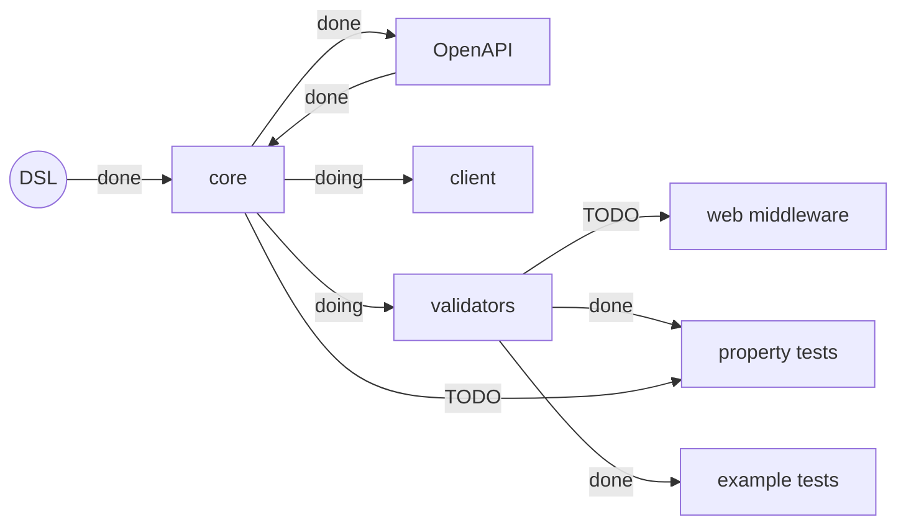

# Responsible

```mermaid
flowchart LR
nl5nta7qaru((DSL))
nl5ntaat4wat[<p>core</p>]
nl5ntadjrf2n[<p>OpenAPI</p>]
nl5ntas4l81u[<p>client</p>]
nl5ntav2f0da[<p>web middleware</p>]
nl5ntay5b7y[<p>property tests</p>]
nl5v6qw5ttu7[<p>validators</p>]
nl5v6rmclbkp[<p>example tests</p>]
nl5nta7qaru -->|done| nl5ntaat4wat
nl5ntaat4wat -->|done| nl5ntadjrf2n
nl5ntaat4wat -->|doing| nl5ntas4l81u
nl5v6qw5ttu7 -->|TODO| nl5ntav2f0da
nl5ntadjrf2n -->|done| nl5ntaat4wat
nl5ntaat4wat -->|doing| nl5v6qw5ttu7
nl5v6qw5ttu7 -->|done| nl5ntay5b7y
nl5v6qw5ttu7 -->|done| nl5v6rmclbkp
nl5ntaat4wat -->|TODO| nl5ntay5b7y
```
